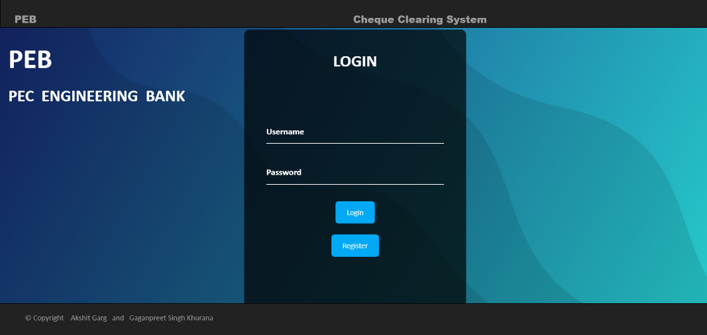

#                                    Cheque Clearing System

# PEB- PEC ENGINEERING BANK

In this project, we tried to automate the cheque clearing system that nowadays is a manual process and takes approximately 3-4 working days.

This project is made by HTML, CSS, Bootstrap, Django, Python ,Sqlite, OpenCV etc.

# SAMPLE HOME BRANCH CHEQUES :-

# In order to run this project follow the following steps: -

1 -> Download the above Contents

2 -> Run cmd and give the following command

       Python manage.py runserver
        
 
 
3 -> Then on any web browser type url
        http://127.0.0.1:8000/main
        
        This will take you to the main Registration / Login page.
        
 
           
        
4 -> To explore the database type the following url on any browser

        http://127.0.0.1:8000/admin

# This Web App basically consists of the following : -

# 1 -> Registration

       Bearer of any bank in order to avail the online services has to        
       register once, which will enable him to set a unique username 
       and password that can be used later anytime.
       If the details matches with the bank database at the time of   
       registration than a welcome message is displayed else a “Account 
       Not Found” is displayed.
       
  
       
  
             

# 2-> Details Page

       Whenever Bearer wants to deposit a cheque for clearance he has to
       Login with his username and password, add details of cheque and
      upload a soft copy of cheque that will be used for further processing.
      
  
         

# 3 -> Verification

        After this the scanned copy of cheque is sent to payee bank where 
        It is checked and if the cheque gets cleared the amount is credited 
        In bearer’s account and it is debited from payee’s account.
        
   
        
   
        
       

# 4 -> Confirmation messages

       At last the confirmation messages which holds the status of the 
       cheque clearance along with the updated balance is sent to both the 
       parties.
       
  
       
  
      

# SPECIAL CHANGES (only for users using windows): -
In order to run this project, you need to install OpenCV and Tesseract.
Also, the complete path of Tesseract needs to be given in extractDetails.py file as
Pt.pytesseract.tesseract_cmd=r’C:\Users\Python37-32\Tesseract.exe’

Also for able to send the messages you need to have proper authentication key.Just add the key in confirmationmsgs.py file agter authentication="abcdefgh" and you would be able to send the messages.

NOTE: THE ACCOUNT NUMBERS, SIGNATURES, NAMES, PHONE NUMBERS, CHEQUE NUMBERS ETC. USED FOR THIS PROJECT ARE JUST RANDOM HYPOTHETICAL NUMBERS/ALPHABETS BUT STILL IF IT MATCHES WITH SOMEONE THEN THAT IS JUST A MERE COINCIDENCE.

